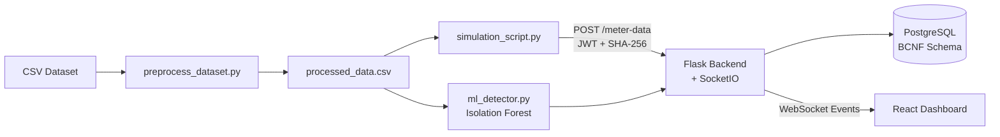

# SmartGrids

```mermaid
graph LR
    A[CSV Dataset] --> B[preprocess_dataset.py]
    B --> C[processed_data.csv]
    C --> D[ml_detector.py<br>Isolation Forest]
    C --> E[simulation_script.py]
    E -->|POST /meter-data<br>JWT + SHA-256| F[Flask Backend<br>+ SocketIO]
    F --> G[(PostgreSQL<br>BCNF Schema)]
    F -->|WebSocket Events| H[React Dashboard]
    D --> F
```

