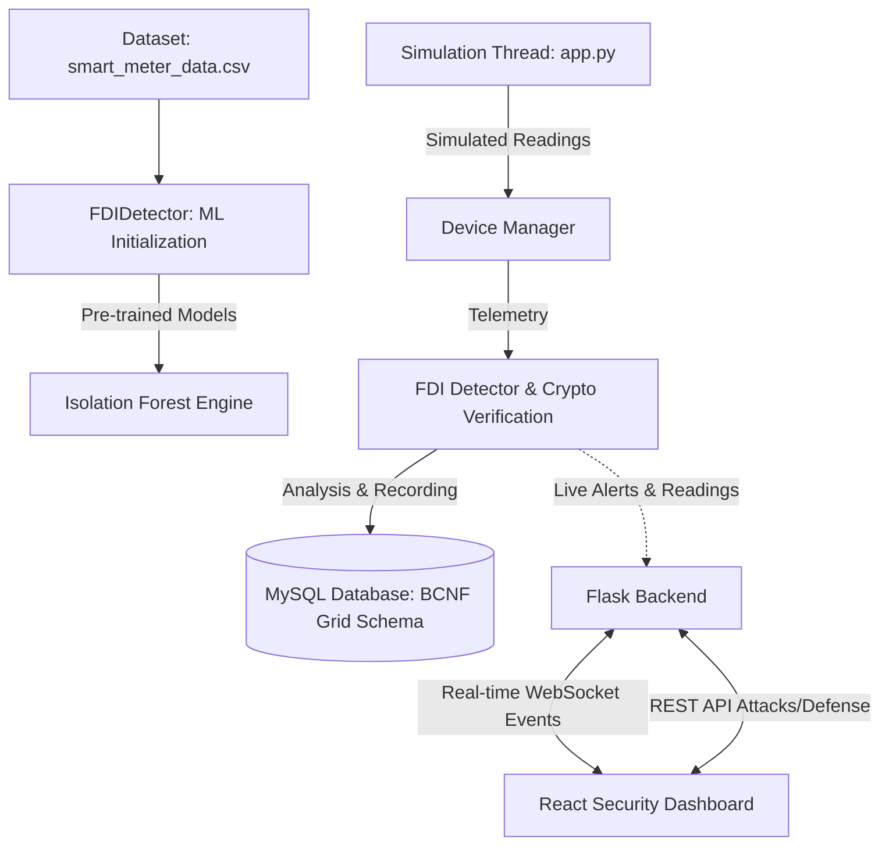

# SecureGrids: Zero-Trust Smart Grid Simulation Platform

SecureGrids is a full-stack, event-driven cybersecurity simulation platform designed to visually demonstrate advanced threat vectors and corresponding active defense mechanisms in modern Smart Grid infrastructure and essentially demonstrate and create a Zero-Trust Architecture.

The system simulates a localized fleet of smart meters (residential, commercial, and industrial) that continuously transmit telemetry data, while a central detection engine intercepts, verifies, and analyzes incoming traffic to dynamically block malicious actors.

## System Architecture



---

## Core Computer Science Concepts

### 1. Zero-Trust Architecture (ZTA)
SecureGrids implements a strict "never trust, always verify" layer model. 
* **Continuous Authentication:** Devices must utilize active JWT authorizations.
* **Cryptographic Integrity:** Payloads are hash-signed. Any discrepancy between the received signature and the calculated signature implies an active Man-In-The-Middle (M.I.T.M) attack.
* **Active Isolation & Rate Limiting:** Devices that exhibit anomalous behavior or produce excessive compromised readings (e.g., 5 confirmed False Data Injections in 1 minute) are immediately and automatically isolated from the grid network.

### 2. Machine Learning Anomaly Detection
The backend deploys an unsupervised **Isolation Forest** machine learning model.
* Instead of relying entirely on static threshold conditions (like standard Z-Scores), the system trains an individual Isolation Forest algorithm against the unique historical data pattern of *every single smart meter*. 
* This allows the system to accurately identify sophisticated False Data Injection (FDI) attacks that disguise themselves by staying just beneath static radar triggers.

### 3. Boyce-Codd Normal Form (BCNF) Database Architecture
The SQL backend is strictly normalized to BCNF standards to eliminate data anomalies mapping.
* Device metadata (Types), transient event logs (Reading vs Attack vectors), and authentication tokens are separated by foreign key relationships.
* This guarantees atomic logging: a compromised device can have its authorization cascaded out of the system without affecting historical telemetry persistence.

### 4. Event-Driven Concurrency
The Python (`Flask`/`Flask-Sock`) backend operates asynchronously:
* A background `threading` daemon continuously generates realistic network traffic simulating intervals across all active meters.
* WebSocket connections push real-time defense analysis and readings immediately to the React execution thread, preventing UI blocking or aggressive short-polling.

---

## Tech Stack

**Frontend (Client Layer)**
* **Core:** React.js + Vite (JavaScript)
* **Styling:** Tailwind CSS v4 (Bento Box aesthetics, Native Dark Mode)
* **Icons & UI:** Lucide React, Recharts (Real-time data visualization)
* **Routing:** React Router v6

**Backend (Detection Engine & API)**
* **Core:** Python 3 + Flask API
* **WebSockets:** `Flask-Sock`
* **Data Science:** `scikit-learn` (IsolationForest), `numpy`
* **Authentication:** `PyJWT`

**Database Layer**
* **Engine:** MySQL/PostgreSQL 
* **Connector:** `mysql-connector-python`

---

## How to Run Locally

### Prerequisites
* **Node.js** (v18+)
* **Python** (v3.10+)
* **MySQL Server** running locally (Default port `3306`)

### Step 1: Database Setup
1. Open your MySQL client (e.g., MySQL Workbench, DBeaver, or CLI).
2. Execute the entire contents of the `grid.sql` file. This will safely spin up the `grid` database, implement the normalized tables, and seed the `device_types`.

### Step 2: Backend Initialization
Open your terminal and boot up the ML Detection Engine.
```bash
# Navigate to the backend directory
cd backend

# Create and activate a Virtual Environment
python -m venv venv
.\venv\Scripts\activate   # Windows
# source venv/bin/activate # Mac/Linux

# Install all required Python dependencies
pip install -r requirements.txt

# Run the detection server
python app.py
```

### Step 3: Frontend Interface
Open a second terminal to run the UI.
```bash
# Navigate to the frontend directory
cd frontend

# Install the necessary Node packages
npm install

# Start the Vite development server
npm run dev
```